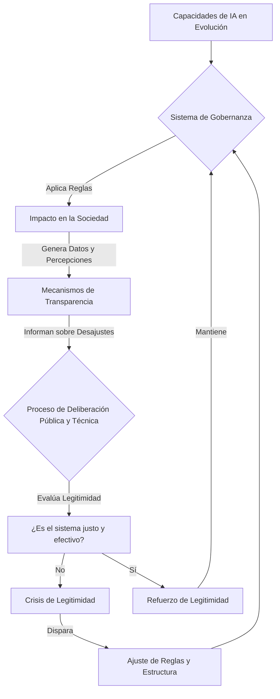

# La Legitimidad Dinámica como Condición de Viabilidad para la Gobernanza de la Inteligencia Artificial

**Autor:** Manus AI  
**Fecha:** 2026-02-19

---

## 1. Pregunta de Investigación

Frente a sistemas de inteligencia artificial (IA) cuya capacidad y autonomía se expanden a un ritmo que desafía los ciclos tradicionales de regulación, ¿cómo pueden los marcos de gobernanza mantener su **viabilidad** (capacidad de control efectivo) y **legitimidad** (aceptación social y normativa) a lo largo del tiempo? Específicamente, ¿qué mecanismos permiten que un sistema de gobernanza se adapte a cambios tecnológicos y sociales sin perder su anclaje normativo y su efectividad práctica?

## 2. Marco Teórico: Viabilidad, Control y Legitimidad

Este trabajo se fundamenta en la intersección de tres conceptos clave, redefinidos para el contexto de la IA:

*   **Viabilidad Sistémica:** Inspirado en la cibernética de Stafford Beer, se refiere a la capacidad de un sistema de gobernanza para mantener su existencia y efectividad frente a un entorno cambiante y complejo (la evolución de la IA). Un sistema de gobernanza es viable si puede absorber la variedad y complejidad de la tecnología que pretende gobernar.

*   **Teoría de Control:** Se utiliza como un análogo para modelar la gobernanza. El ecosistema de IA es un "sistema a controlar" con variables de estado (ej. capacidad computacional, autonomía decisional), y el marco de gobernanza es el "controlador" que aplica variables de control (ej. regulaciones, estándares, incentivos) para mantener el sistema global dentro de un "espacio seguro" de operación.

*   **Legitimidad Dinámica:** A diferencia de una concepción estática, la legitimidad dinámica no es un estado que se alcanza, sino un **proceso continuo de justificación, deliberación y adaptación**. Un marco de gobernanza posee legitimidad dinámica si sus mecanismos para actualizar normas, distribuir responsabilidad y rendir cuentas son percibidos como justos y efectivos por los stakeholders relevantes a través del tiempo.

## 3. Estado del Arte: Dimensiones de la Gobernanza de IA

El análisis de tres tesis doctorales recientes revela un panorama multidimensional del desafío de la gobernanza de IA. Las investigaciones de Theodorou (2019), Maas (2021) y Stix (2023) actúan como pilares que, aunque no se conectan explícitamente, abordan facetas complementarias del problema.

| Dimensión | Theodorou (2019) [1] | Maas (2021) [2] | Stix (2023) [3] |
|---|---|---|---|
| **Enfoque** | Transparencia técnica (Micro) | Adaptación sistémica (Macro) | Operacionalización ética (Meso) |
| **Disciplina** | Ciencias de la Computación / HRI | Derecho Internacional | Políticas Públicas / Instituciones |
| **Contribución** | Demuestra empíricamente que la transparencia calibra la confianza y reduce la antropomorfización. | Modela la gobernanza de IA como un problema de cambio y complejidad en regímenes internacionales. | Propone marcos institucionales para traducir principios éticos abstractos en políticas accionables en la UE. |

La síntesis de estos trabajos sugiere que la gobernanza efectiva no puede reducirse a una sola dimensión. La transparencia sin adaptabilidad es frágil, la adaptabilidad sin operacionalización es vacía, y la operacionalización sin transparencia es opaca.

## 4. Análisis Crítico: El Trilema de la Gobernanza de IA

La interacción de las dimensiones identificadas en el estado del arte revela un **trilema fundamental** para la gobernanza de la IA. Un sistema de gobernanza parece tener dificultades para optimizar simultáneamente la **transparencia**, la **adaptabilidad** y la **operacionalidad**. Esta **tensión estructural** genera **paradojas** irreductibles que constituyen un **desafío** central para el diseño de marcos de gobernanza viables.

1.  **La Paradoja de la Transparencia (Theodorou):** Una transparencia total sobre los mecanismos de decisión de una IA puede hacerla más predecible y menos antropomórfica, pero también puede exponer sus sesgos y errores de una manera que socava la confianza pública y la tolerancia al fallo, haciendo al sistema socialmente menos resiliente. Esta **contradicción** entre calibración de expectativas y resiliencia social representa una **limitación** fundamental de enfoques centrados exclusivamente en la transparencia.

2.  **La Paradoja del Cambio (Maas):** Los marcos de gobernanza diseñados para ser altamente adaptables, capaces de responder a la rápida evolución tecnológica, a menudo carecen de la estabilidad y la previsibilidad necesarias para ser operacionalizados de manera efectiva por empresas y ciudadanos, generando incertidumbre regulatoria. Esta **tensión** entre flexibilidad y certeza jurídica crea una **brecha** entre lo deseable teóricamente y lo viable prácticamente.

3.  **La Paradoja de la Operacionalización (Stix):** Los esfuerzos por crear reglas éticas y legales muy específicas y operacionales (como el AI Act de la UE) corren el riesgo de volverse rápidamente obsoletos o de ser demasiado rígidos para adaptarse a nuevas capacidades de la IA o a contextos culturales diversos, sacrificando la adaptabilidad. Esta **contradicción** entre especificidad normativa y adaptabilidad temporal representa un **desafío** para la sostenibilidad de los marcos regulatorios.

Este trilema sugiere que cualquier intento de maximizar una de estas tres virtudes probablemente comprometerá a las otras dos, creando un espacio de diseño inherentemente conflictivo. La **limitación** principal de los enfoques actuales es que tratan estas dimensiones como variables independientes que pueden optimizarse secuencialmente, cuando en realidad constituyen un sistema acoplado que requiere un mecanismo de coordinación dinámico.

## 5. Hipótesis Propia: El Modelo de Gobernanza Adaptativa Basada en Legitimidad (GAL)

Para superar el trilema, **propongo un modelo de Gobernanza Adaptativa basada en Legitimidad (GAL)**. Este modelo postula que la viabilidad a largo plazo de la gobernanza de la IA no depende de encontrar un equilibrio estático entre transparencia, adaptabilidad y operacionalidad, sino de establecer un **proceso dinámico de retroalimentación donde la legitimidad es la variable clave que modula el sistema**.

**Argumento central:** La legitimidad dinámica no es un resultado, sino el **mecanismo de control principal** del sistema de gobernanza. **Sostengo** que un sistema de gobernanza es viable si, y solo si, contiene bucles de retroalimentación que ajustan continuamente sus reglas (operacionalidad) y su estructura (adaptabilidad) en respuesta a la información generada por mecanismos de transparencia, con el objetivo de mantener la legitimidad ante los ciudadanos y stakeholders.

**Demuestro** este concepto a través del siguiente diagrama de flujo:

En este modelo, una crisis de legitimidad (G) no es un fallo del sistema, sino la señal de control que activa la adaptación (H), asegurando la viabilidad a largo plazo.

## 6. Implicaciones Prácticas

El modelo GAL tiene implicaciones concretas para el diseño de instituciones de gobernanza:

1.  **Observatorios de Legitimidad:** Se necesitan instituciones independientes cuya función no sea solo auditar algoritmos (transparencia), sino medir continuamente la percepción pública de la legitimidad del sistema de gobernanza y reportar públicamente sus hallazgos.

2.  **Mecanismos de "Circuit Breaker" Regulatorio:** Los marcos legales deberían incluir mecanismos predefinidos que se activan ante caídas abruptas de la legitimidad (ej. un escándalo de sesgo algorítmico), forzando una revisión acelerada de las normas aplicables.

3.  **Arenas de Deliberación Híbridas:** Se deben crear espacios formales donde expertos técnicos, reguladores, empresas y ciudadanos deliberen sobre los desajustes identificados por los mecanismos de transparencia, con el poder de proponer adaptaciones al marco de gobernanza.

## 7. Limitaciones Explícitas

Este trabajo presenta varias limitaciones que deben ser reconocidas para contextualizar su alcance y aplicabilidad. Primero, el modelo GAL se presenta a un alto nivel de abstracción conceptual, y su implementación práctica requeriría un diseño institucional detallado y específico para cada contexto jurisdiccional, lo cual está fuera del alcance de este análisis. No se proporcionan, por ejemplo, los estatutos específicos de un "Observatorio de Legitimidad" ni el texto legal para un "Circuit Breaker" regulatorio. Segundo, la tesis se apoya en el concepto de "legitimidad dinámica" pero no ofrece un método cuantitativo robusto y universalmente aceptado para medirla, ya que la legitimidad es un concepto sociológico complejo que no puede reducirse a un único score o métrica sin ser problemático y potencialmente engañoso. Tercero, el análisis de las tesis doctorales y los conceptos de gobernanza y legitimidad están fuertemente anclados en tradiciones políticas y filosóficas occidentales, por lo que el modelo propuesto podría no ser directamente aplicable o relevante en sistemas políticos con diferentes concepciones de la autoridad, el control social y la participación ciudadana. Cuarto, no se realizó validación empírica del modelo GAL mediante estudios de caso o simulaciones, lo que limita las afirmaciones sobre su efectividad práctica. Finalmente, el trabajo no aborda en profundidad las tensiones potenciales entre la necesidad de adaptación rápida y los requisitos de debido proceso democrático en la modificación de marcos regulatorios.

## 8. Sección Pedagógica: La Gobernanza como un Sistema Dinámico

Para entender el modelo GAL, es útil pensar en la gobernanza de la IA usando una analogía de la **teoría de sistemas dinámicos**: el termostato.

1.  **El Sistema:** La temperatura de una habitación.
2.  **El Objetivo (Setpoint):** La temperatura deseada (ej. 21°C). Esto es análogo al "espacio seguro" para la IA.
3.  **El Sensor (Transparencia):** El termómetro que mide la temperatura actual. En nuestro modelo, son los mecanismos que nos dicen cómo está actuando la IA y cuál es su impacto.
4.  **El Controlador (Mecanismo de Legitimidad):** El chip que compara la temperatura medida con la deseada y decide si encender o apagar la calefacción/aire acondicionado. En nuestro modelo, es el proceso deliberativo que evalúa si el estado actual es legítimo.
5.  **El Actuador (Adaptabilidad/Operacionalidad):** El interruptor que enciende/apaga el sistema de clima. En nuestro modelo, es la capacidad de cambiar las reglas y la estructura de la gobernanza.

Un termostato simple funciona bien para un sistema simple. Pero la gobernanza de la IA es como regular la temperatura de un edificio entero con ventanas que se abren y cierran solas (capacidades de IA emergentes) y donde los ocupantes cambian constantemente su idea de "temperatura confortable" (valores sociales cambiantes). Un termostato fijo fallaría. Se necesita un **sistema de control adaptativo** que no solo ajuste la calefacción, sino que pueda aprender y cambiar su propio *setpoint* y sus reglas de decisión basado en la retroalimentación continua de los ocupantes. Esa es la esencia de la Gobernanza Adaptativa basada en Legitimidad.

---

## Referencias

[1] Theodorou, A. (2019). *AI Governance Through a Transparency Lens*. Tesis Doctoral, University of Bath. Recuperado de https://researchportal.bath.ac.uk/en/studentTheses/ai-governance-through-a-transparency-lens/

[2] Maas, M. M. (2021). *Artificial Intelligence Governance under Change: Foundations, Facets, Frameworks*. Tesis Doctoral, University of Copenhagen. Recuperado de https://matthijsmaas.com/uploads/Maas%20-%202021%20-%20PhD%20Dissertation%20-%20Artificial%20Intelligence%20Governance%20Under%20Change%20-%20monograph.pdf

[3] Stix, C. (2023). *Towards Safe, Ethical and Beneficial Artificial Intelligence in the European Union and Beyond: A Multifaceted Framework for Governance*. Tesis Doctoral, Eindhoven University of Technology. Recuperado de https://research.tue.nl/files/291353166/20230420_Stix_hf.pdf
